# 🛡️ Awesome Insurance Fraud Detection 🚨

  

  
  
  
  
  
  

## 📌 Top Insurance Fraud Detection Platforms Ecosystem

**Curated List of Enterprise SaaS Products, AI Risk Engines & Open-Source GitHub Projects** 🧠🔍

*Focused on Claims Fraud, Underwriting Fraud, Network Analytics, AI Anomaly Scoring, Entity Resolution & SIU (Special Investigation Units) Support.*

**Last updated: September 2026** 📅

---

### 💡 Overview & SEO Highlights
Insurance fraud causes tens of billions of dollars in annual losses across Property & Casualty (P&C), Health, Life, and Auto insurance sectors. Modern **insurance fraud detection platforms** leverage machine learning (ML), unsupervised anomaly detection, automated entity resolution, social network analysis (SNA), and explainable AI (XAI) to flag suspicious claims, identify organized fraud rings, and reduce claim leakage while maintaining low false-positive rates.

---

## 📑 Table of Contents
- [🏢 SaaS/Hosted Platforms](#-saashosted-platforms)
- [💻 Open-Source GitHub Projects](#-open-source-github-projects)
- [🤝 How to Contribute](#-how-to-contribute)
- [💖 Support & Sponsorship](#-support--sponsorship)
- [📈 Star History](#-star-history)
- [⚠️ Disclaimer](#%EF%B8%8F-disclaimer)

---

## 🏢 SaaS/Hosted Platforms

> 📊 **Market Size & Structure**: The global **Insurance Fraud Detection Market** is estimated at **$4.5 Billion - $5.2 Billion (2026)** and is projected to reach over **$12 Billion by 2030** (CAGR ~24-26%). The sector is **moderately fragmented**, featuring category-specific incumbents (NICE Actimize, SAS, FICO) alongside fast-growing specialized InsurTech unicorns (Shift Technology, Featurespace, Feedzai, Quantexa) and niche underwriting/claims providers.

### 💼 Top SaaS Platforms (Sorted by Company Size / Revenue & Valuation Descending)

| Platform | Description | Key Features | Pricing Tier (Starting) | Free Tier / Trial Limits | Company Size / Revenue & Valuation |
| :--- | :--- | :--- | :--- | :--- | :--- |
| **[BAE Systems NetReveal](https://www.baesystems.com/)** 🛡️ | Defense & enterprise financial crime platform providing advanced network analytics for insurance fraud. | Network link analysis, entity resolution, risk scoring | Enterprise custom contract (typically starts at $150,000+/year) | No free tier; custom enterprise demo / POC upon request | **~$28.0 Billion** revenue (BAE Systems plc parent group) |
| **[SAS Fraud Management](https://www.sas.com/)** 📊 | Enterprise-grade insurance analytics framework covering claims, underwriting, and medical fraud. | Hybrid ML scoring, business rules engine, SIU triage | Standard enterprise tier starts at ~$100,000/year (cloud subscription) | No free tier; 14-day SAS Viya hosted trial with sandbox data | **~$3.2 Billion** annual revenue (Private enterprise leader) |
| **[Actimize (NICE)](https://www.niceactimize.com/)** 🏛️ | Comprehensive financial crime suite applied to property, casualty, and health insurance investigations. | End-to-end SIU case management, consortium analytics | Enterprise plans starting at $80,000+/year | No free trial or free tier; direct sales proof-of-concept only | **~$2.4 Billion** annual revenue (NICE Ltd parent group) |
| **[FICO Falcon](https://www.fico.com/)** 💳 | Proven predictive risk engine adapted from payment security for real-time insurance claim scoring. | Real-time neural scoring, consortium fraud profiling | Commercial enterprise tiers start at ~$60,000/year | No free tier; 30-day interactive evaluation sandbox for partners | **~$1.6 Billion** annual revenue (NYSE: FICO) |
| **[Guidewire Predictive Analytics](https://www.guidewire.com/)** 🚗 | Embedded predictive analytics and fraud scoring engine within the Guidewire core insurance suite. | Core P&C system integration, automated triage | Add-on module pricing starting at ~$50,000/year | No free tier; 30-day sandbox environment for Guidewire Developer Portal users | **~$1.0 Billion** annual revenue (NYSE: GWRE) |
| **[Quantexa](https://www.quantexa.com/)** 🌐 | Contextual decision intelligence platform leveraging graph entity resolution to uncover organized fraud networks. | Entity resolution, dynamic graph networks, SIU UI | Starting commercial tier at $50,000/year (SaaS deployment) | No free tier; custom guided 14-day proof-of-value sandbox | **~$1.8 Billion** valuation ($100M+ ARR) |
| **[Shift Technology](https://www.shift-technology.com/)** 🤖 | AI-native insurance fraud detection platform specialized for claims, underwriting, and healthcare fraud. | Automated claim scoring, document fraud AI, SIU workflows | Enterprise SaaS starting at ~$40,000/year | No free tier; interactive guided demo & sample data test | **~$1.0 Billion** valuation (InsurTech Unicorn) |
| **[Featurespace](https://www.featurespace.com/)** ⚡ | Adaptive Behavioral Analytics (ARIC Risk Hub) for real-time transactional and claim fraud detection. | Adaptive ML models, low false-positive scoring | Professional tier starting at ~$35,000/year | No free tier; customized 30-day sandbox pilot | **~$700 Million** acquisition valuation (Acquired by Visa 2024) |
| **[Feedzai](https://feedzai.com/)** 🧠 | AI-first fraud prevention platform analyzing policy and claims behavioral data in real time. | Real-time scoring, AutoML, explainable AI alerts | Starting tier at $30,000/year | No free tier; guided 14-day sandbox access for enterprise trials | **~$1.0 Billion+** valuation ($100M+ ARR) |
| **[Sift](https://sift.com/)** 🔒 | Digital trust & fraud prevention platform protecting online insurance portals from account takeover and policy abuse. | Digital footprinting, ATO defense, chargeback protection | Pay-As-You-Go starting at $0.05/event (min $500/month, $6,000/year) | 30-day free trial with up to 10,000 free test events | **~$1.0 Billion+** valuation (Private tech unicorn) |
| **[DataVisor](https://www.datavisor.com/)** 🕸️ | Unsupervised machine learning platform detecting coordinated fraud attacks and synthetic identities. | Unsupervised clustering, graph analytics, real-time rules | Enterprise tier starting at $25,000/year | 14-day free trial sandbox for API test evaluation | **~$400 Million** valuation ($30M+ ARR) |
| **[FRISS](https://www.friss.com/)** 📝 | Pure-play insurance fraud detection system providing automated underwriting and claims risk scores. | Standardized carrier risk index, automated red flags | SaaS tier starting at ~$20,000/year | No free tier; 14-day trial environment for qualified carriers | **~$300 Million** valuation ($40M+ ARR) |
| **[Fraud.net](https://www.fraud.net/)** 🤝 | Cloud-native fraud management stack offering collaborative consortium intelligence and AI models. | Microservices API, consortium data sharing, rule builder | Starter plan at $999/month (~$12,000/year) | 14-day free trial with 5,000 free API queries | **~$100 Million** valuation ($15M+ ARR) |

---

## 💻 Open-Source GitHub Projects

Domain-specific insurance fraud platforms are predominantly commercial. However, production-grade fraud engines are built using open-source **graph neural networks**, **anomaly detection frameworks**, **gradient boosting algorithms**, and **explainable AI (XAI)** toolkits.

### 🌟 Featured Open-Source Projects (Sorted by GitHub Stars Descending)

- **[scikit-learn/scikit-learn](https://github.com/scikit-learn/scikit-learn)** 🤖  
    
  *Industry-standard machine learning library in Python used to build supervised risk models, decision trees, and baseline classification pipelines for claims fraud.*

- **[microsoft/graphrag](https://github.com/microsoft/graphrag)** 🕸️  
    
  *Graph-based Retrieval-Augmented Generation framework for discovering complex entity relationships and unstructured text knowledge in claim files.*

- **[dmlc/xgboost](https://github.com/dmlc/xgboost)** ⚡  
    
  *Scalable, optimized gradient boosting library widely deployed in production for tabular insurance risk scoring and claim fraud classification.*

- **[shap/shap](https://github.com/shap/shap)** 🔍  
    
  *Explainable AI toolkit using Shapley Additive exPlanations to explain machine learning predictions to Special Investigation Units (SIU) and auditors.*

- **[pyg-team/pytorch_geometric](https://github.com/pyg-team/pytorch_geometric)** 🧬  
    
  *Graph Neural Network (GNN) framework built on PyTorch, ideal for modeling complex relationships between policyholders, claimants, repair shops, and doctors.*

- **[microsoft/LightGBM](https://github.com/microsoft/LightGBM)** 🚀  
    
  *Fast, high-performance gradient boosting framework tailored for large-scale tabular insurance claims and policy datasets.*

- **[networkx/networkx](https://github.com/networkx/networkx)** 🌐  
    
  *Python graph analytics library used for building claims networks, finding connected components, and uncovering suspicious fraud rings.*

- **[yzhao062/pyod](https://github.com/yzhao062/pyod)** 🚨  
    
  *Comprehensive Python toolkit for detecting outliers and anomaly scores in unsupervised claims data.*

- **[catboost/catboost](https://github.com/catboost/catboost)** 🐱  
    
  *High-performance gradient boosting library optimized for categorical features standard in insurance applications (e.g., policy types, medical codes).*

- **[evidentlyai/evidently](https://github.com/evidentlyai/evidently)** 📊  
    
  *Open-source ML observability platform to evaluate, test, and monitor fraud detection model drift and data quality in production pipelines.*

- **[scikit-learn-contrib/imbalanced-learn](https://github.com/scikit-learn-contrib/imbalanced-learn)** ⚖️  
    
  *Python package relying on scikit-learn for handling severe class imbalance in rare-event fraud classification datasets (e.g., SMOTE, undersampling).*

- **[salesforce/Merlion](https://github.com/salesforce/Merlion)** 📈  
    
  *Python library for time series intelligence, anomaly detection, and forecasting in high-frequency claim submission environments.*

- **[seldonio/alibi-detect](https://github.com/seldonio/alibi-detect)** 🛡️  
    
  *Open-source Python library focused on outlier, adversarial, and concept drift detection for enterprise production ML models.*

- **[facebookresearch/pysparnn](https://github.com/facebookresearch/pysparnn)** 🔍  
    
  *Efficient sparse nearest neighbor search in Python for fast similarity matching across large claims and party records.*

- **[safe-graph/UGFraud](https://github.com/safe-graph/UGFraud)** 🕸️  
    
  *Unsupervised graph-based fraud detection toolbox implementing Markov Random Fields (MRF) and dense-block algorithms for network fraud patterns.*

---

## 🤝 How to Contribute

Contributions are welcome! Please follow these simple guidelines: 📑

1. **Fork** the repository. 🍴
2. Create a feature branch (`git checkout -b feature/new-platform`). 🌿
3. Add/update factual information in `README.md` following the existing markdown table or list structure. 📝
4. Open a **Pull Request** with a concise description of your changes. 🚀

---

## 💖 Support & Sponsorship

If you find this repository helpful for your InsurTech research, SIU operations, or data science projects, please consider supporting the project! ⭐

- **Star this repo**: Click the ⭐ button at the top right of this page!
- **Share**: Spread the word with your peers, colleagues, and network. 📢
- **Sponsor**: Buy us a coffee via the [GitHub Sponsor Dashboard](https://github.com/sponsors/ishandutta2007)! ☕

  

---

## 📈 Star History

---

## ⚠️ Disclaimer

- This list is **community-curated** for educational and informational purposes only — it does not constitute official endorsement. ℹ️
- Insurance fraud detection engines handle sensitive personal identifiable information (PII) and financial claims data. Deployed systems must adhere to strict data privacy laws (GDPR, CCPA, HIPAA) and regulatory compliance standards. ⚖️

---

  <b>Made for insurance fraud leaders, SIU teams, and data scientists fighting claims and underwriting fraud. 🛡️</b>

